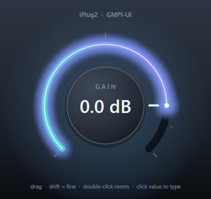

# iPlug2 + GMPI-UI

A gain plugin whose DSP is [iPlug2](https://github.com/iPlug2/iPlug2) and whose
user interface is [GMPI-UI](https://github.com/JeffMcClintock/gmpi_ui), instead of
iPlug2's own IGraphics.



Builds as a VST3, an Audio Unit, and a standalone app, on Windows and macOS. All
three dependencies are fetched by CMake — there is nothing to download by hand.

```bash
cmake -S . -B build
cmake --build build --config Release
```

The first configure clones iPlug2 and the Steinberg VST3 SDK, so give it a few
minutes. To build against local checkouts instead, set any of
`-DIPLUG2_FOLDER_OVERRIDE=…`, `-DGMPI_UI_FOLDER_OVERRIDE=…`,
`-DGMPI_SDK_FOLDER_OVERRIDE=…`.

## How the two frameworks meet

iPlug2 does not require IGraphics. Building with `UI NONE` and `NO_IGRAPHICS`
leaves the plugin deriving from `IEditorDelegate`, whose editor contract is two
functions:

```cpp
void* OpenWindow(void* pParent);  // return an HWND / NSView*
void  CloseWindow();
```

That is exactly the shape GMPI-UI's window hosting already has, so the whole
integration is one small class:

| | Windows | macOS |
|---|---|---|
| host window | `gmpi::hosting::DrawingFrame` | `createNativeView()` |
| renderer | Direct2D (`backends/DirectXGfx`) | CoreGraphics (`backends/CocoaGfx`) |

[`GmpiPlugFrame`](src/GmpiPlugFrame.h) hides that split behind `Open`/`Close`,
with one small implementation per platform. Everything else is portable.

### Parameters

The UI never sees iPlug2. [`GainView`](src/GainView.h) is a plain GMPI-UI
`IDrawingClient` + `IInputClient` that reports changes through a three-function
interface — begin gesture, new value, end gesture — in normalized 0..1 units.

[`IPlugGmpiGain`](src/IPlugGmpiGain.cpp) implements that interface with iPlug2's
standard calls, and pushes values the other way in `OnParamChangeUI`:

```
GainView  ──OnKnobValueChanged──▶  SendParameterValueFromUI
GainView  ◀──────SetValue───────  OnParamChangeUI
```

Because iPlug2 routes host automation through `OnParamChangeUI` too, automating
the parameter from the DAW moves the knob with no extra code.

Clicking the readout opens a native text field via GMPI-UI's
`IDialogHost::createTextEdit`, and the typed string goes back through the same
interface. The view does not parse it — iPlug2's `IParam::StringToValue` does,
because the parameter owns its units.

## Notes on the drawing

- The knob's halo is a real gaussian blur, not stacked translucent strokes: the
  arc is rendered into an offscreen mask, blurred and tinted by
  `helpers/CachedBlur.h`, and cached until the value changes.
- The layout derives every dimension from the rect the host supplies, so it is
  correct at any DPI rather than assuming the nominal `PLUG_WIDTH`/`PLUG_HEIGHT`.
- No image or font assets. It is all vectors and system fonts.

## Build details worth knowing

Two things in `CMakeLists.txt` exist to smooth over rough edges rather than
because the integration needs them:

- iPlug2 vendors RTAudio and RTMidi but not the VST3 SDK, which its own
  `download-vst3-sdk.sh` normally fetches by hand. CMake does it here instead,
  into the path iPlug2 hardcodes.
- GMPI-UI's Win32 backend is a `UNICODE` build; iPlug2's standalone-app code is
  ANSI. The GMPI-UI backends are therefore compiled into their own static
  library so the define stays private to them.

## Licence

MIT. iPlug2, GMPI-UI and the VST3 SDK carry their own licences.
